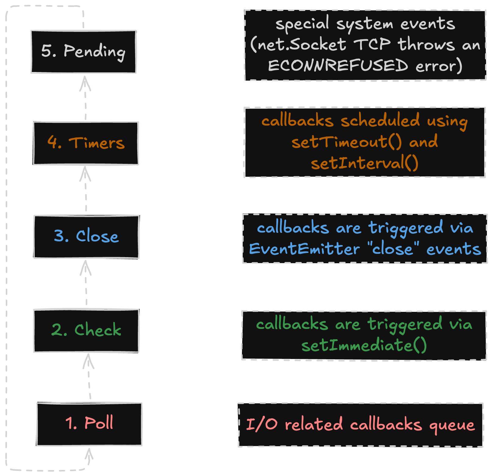

# Chapter 1: Why Distributed?

## Event Loop Phases



## Event loop Tips

### Don't starve the event loop

The passage discusses the importance of managing CPU-intensive tasks in Node.js to prevent stalling the event loop.

It suggests breaking down large tasks into smaller batches and using setImmediate() to schedule the next batch, allowing other callbacks to execute in between. This approach helps maintain responsiveness in the application.

The text warns against using process.nextTick() for such tasks, as it can lead to a microtask queue that never empties, effectively trapping the application in the same phase and consuming CPU resources without progressing.

An example is provided to illustrate the difference: using process.nextTick() in a recursive function can prevent other asynchronous tasks, like setInterval(), from running, whereas using setImmediate() allows them to execute.

### Don't introduce Zalgo

When exposing a method that takes a callback, that callback should always be run asynchronously. For example, it’s far too easy to write something like this:

```javascript
// Antipattern
function foo(count, callback) {
  if (count <= 0) {
    return callback(new TypeError('count > 0'));
  }
  myAsyncOperation(count, callback);
}
```

The callback is sometimes called synchronously, like when count is set to zero, and sometimes asynchronously, like when count is set to one. Instead, ensure the callback is executed in a new stack, like in this example:

```javascript
function foo(count, callback) {
  if (count <= 0) {
    return process.nextTick(() => callback(new TypeError('count > 0')));
  }
  myAsyncOperation(count, callback);
}
```

In this case, either using setImmediate() or process.nextTick() is okay; just make sure you don’t accidentally introduce recursion. With this reworked example, the callback is always run asynchronously. Ensuring the callback is run consistently is important because of the following situation:

```javascript
let bar = false;
foo(3, () => {
  assert(bar);
});
bar = true;
```

This might look a bit contrived, but essentially the problem is that when the callback is sometimes run synchronously and sometimes run asynchronously, the value of bar may or may not have been modified. In a real application this can be the difference between accessing a variable that may or may not have been properly initialized.
